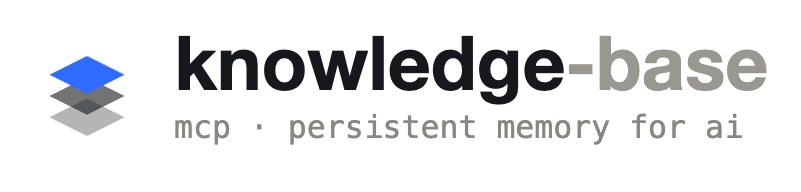

An MCP server for Claude Code that provides persistent document storage using SQLite. Organize your ideas, specs, plans, and feature documentation in a structured three-level hierarchy — track the full lineage of how ideas evolve into specs and plans, and link plans to the git commits that implement them.

```
workspace → feature → content (idea | spec | plan | digest | doc)
```

## Features

- **Persistent storage** — all content survives across Claude Code sessions
- **Five content types** — `idea`, `spec`, `plan`, `doc` (current-state feature docs), plus `digest` for summaries
- **Content lineage** — track provenance chains (`idea → spec → plan`); navigate ancestors and descendants with `get_lineage`, link documents with `link_content`, or create a derived document in one step with `derive_content`
- **Auto-suggest parents** — when creating a `spec` or `plan`, Claude automatically surfaces semantically similar parent candidates from the same workspace so you can link them without manual lookup
- **Optional title field** — short label on any document for easy scanning in list/search results
- **Semantic search** — on-device vector similarity search powered by `sqlite-vec` and a local ONNX embedding model (multilingual, 50+ languages including Vietnamese); title matches are weighted 5× above body matches; recent documents receive a small recency boost (up to +20% for today, 30-day half-life); supports pagination via `offset` so callers can page through results beyond the initial `limit`
- **Code grounding** — link plan documents to git commits at task granularity; `attach_code_ref` records which commit implements which task, `get_code_refs` returns the full coverage map, `get_content` includes a `has_code_refs` signal so Claude knows to fetch refs without a round-trip
- **Error log viewer** — every unhandled MCP tool exception is captured to SQLite and viewable in the GUI at `/errors`
- **SQLite-backed** — single file database via `better-sqlite3`, no external services
- **Claude Code skills** — 11 slash commands for create, list, search, get, update, delete, import, export, explore, digest, and doc analysis
- **Claude Code agents** — reusable agent personas installed alongside skills; `kb-conflict-resolver` provides deep conflict analysis when `semantic_contradiction` is detected

## Requirements

- Node.js 22.5 or later
- C++ build tools (for `better-sqlite3` native addon):
  - macOS: `xcode-select --install`
  - Linux: `sudo apt-get install build-essential`
  - Windows: `npm install -g windows-build-tools`

  Most users won't need this — prebuilt binaries are bundled for common platforms. If startup fails with a native addon error, run the command above then `npm rebuild better-sqlite3`.

## Setup

### 1. Add the MCP server

Run this once in any terminal:

```bash
claude mcp add knowledge-base -- npx -y @vulhdev/knowledge-base
```

That's it. On first run the server creates `~/.claude/knowledge-base/settings.json` and stores the database at `~/.claude/knowledge-base/knowledge-base.db`.

### 2. (Optional) Initialize a workspace

To link a Claude Code project to a specific workspace and install skills, run:

```bash
npx @vulhdev/knowledge-base init
```

The wizard will:
1. Prompt you to select or create a **workspace** — writes `KNOWLEDGE_BASE_WORKSPACE=<name>` to `CLAUDE.md`
2. **Download the embedding model** (~120 MB, first time only) to `~/.cache/knowledge-base/models/` — required for semantic search. Skipped automatically if already cached.
3. Ask where to install **Claude Code skills**:
   - **Global** (`~/.claude/skills/`) — available in all projects
   - **This project** (`./.claude/skills/`) — current project only
   - **Skip**
4. Ask where to install **Claude Code agents**:
   - **Global** (`~/.claude/agents/`) — available in all projects
   - **This project** (`./.claude/agents/`) — current project only
   - **Skip**

After installing, restart Claude Code to pick up the new skills and agents.

### 3. (Optional) Update skills

When a new version is released, update your installed skills with:

```bash
npx @vulhdev/knowledge-base update
```

Auto-detects skills installed in `~/.claude/skills/` and `./.claude/skills/`, and overwrites them only if the version has changed. Warns if no installed skills are found (run `init` first).

### 4. (Optional) Browse with the GUI

To explore your knowledge base in a browser, run:

```bash
npx @vulhdev/knowledge-base gui
```

Opens a read-only web UI at `http://localhost:3000` (override with `PORT=<n>`). Browse workspaces → features → documents, search across all content, or open the **Errors** tab to inspect recent MCP tool failures.

## Claude Code Skills

Skills use colon namespace notation — type the part after the colon to get autocomplete suggestions (e.g. `/doc` → `knowledge-base:doc`).

| Skill | When to use |
|---|---|
| `/create` → `knowledge-base:create` | Save a spec, plan, idea, or doc from the current conversation |
| `/list` → `knowledge-base:list` | Browse all documents in a feature (no keyword needed) |
| `/search` → `knowledge-base:search` | Semantic search — finds relevant documents even without exact keywords |
| `/get` → `knowledge-base:get` | Read the full body of a specific document by ID or description |
| `/update` → `knowledge-base:update` | Merge new content into an existing document |
| `/delete` → `knowledge-base:delete` | Permanently remove a document (with confirmation) |
| `/import` → `knowledge-base:import` | Import markdown files into the knowledge base |
| `/export` → `knowledge-base:export` | Export documents to markdown files |
| `/explore` → `knowledge-base:explore` | Proactively load feature context before starting work |
| `/digest` → `knowledge-base:digest` | Build a TL;DR + index summary for a feature |
| `/doc` → `knowledge-base:doc` | Analyze a codebase feature and save structured docs (DB schema, backend flow, frontend) |

## Claude Code Agents

Agents are reusable personas installed to `~/.claude/agents/` (global) or `.claude/agents/` (project) via `init`. After installation, restart Claude Code to make them available.

| Agent | When to use |
|---|---|
| `kb-conflict-resolver` | Spawned by `/knowledge-base-create` when `semantic_contradiction` is detected — reads both conflicting docs in full, identifies the exact contradicting text, and recommends whether to update, deprecate, or mark as intentional divergence |

## MCP Tools

Once registered, these tools are available to Claude:

### `create_content`

Creates a document. Auto-creates the workspace and feature if they don't exist.

```
workspace  — top-level project or domain (e.g. "my-app")
feature    — capability or area (e.g. "auth")
type       — "idea" | "spec" | "plan" | "digest" | "doc"
title      — (optional) short label for easy identification in lists
body       — document text
```

### `get_content`

Fetches a single document by its numeric ID. Returns all fields including `title` and `has_code_refs: boolean` — a zero-cost signal indicating whether any code refs are attached, so Claude can decide whether to call `get_code_refs` without fetching the data first.

### `list_contents`

Lists documents in a workspace, with optional filters for feature and/or type. Returns `title` on every row.

### `search_semantic`

Semantic (vector) search using a local ONNX embedding model combined with BM25 full-text search via Reciprocal Rank Fusion. Returns a `SearchPage` object — finds relevant content even when exact words don't match. Supports any natural language including Vietnamese.

Ranking signals applied in order:
- **Vector similarity** (ANN via `sqlite-vec`) + **BM25** (FTS5, title weighted 5× over body) fused with RRF
- **Recency boost** — documents updated more recently score slightly higher (max +20% today, 30-day half-life)

Requires the embedding model to be downloaded first (`npx @vulhdev/knowledge-base init`). Embeddings for new and updated documents are generated automatically; existing documents are backfilled in the background on the next server startup after `init`.

```
query      — natural language search query (any language)
workspace  — (optional) scope to a specific workspace
type       — (optional) filter by content type
limit      — max results, 1–50 (default 10)
offset     — (optional) skip first N results for pagination (default 0)
```

Returns a `SearchPage`:
```json
{
  "results":       [...],
  "has_more":      true,
  "total_in_pool": 34,
  "offset":        0,
  "limit":         10
}
```

### `update_content`

Updates the body (and optionally the type and title) of an existing document by ID. Omitting `title` preserves the existing value.

```
id     — document ID
body   — new document body (replaces existing)
type   — (optional) new type, omit to keep existing
title  — (optional) new title, omit to keep existing
```

### `delete_content`

Permanently deletes a document by its numeric ID. Returns the deleted document.

---

### `attach_code_ref`

Links a git commit to a plan (or any document) at task granularity. Call this after each task commit so that resuming a plan in a new session immediately shows which tasks are done.

```
content_id   — ID of the plan to attach the commit to
commit_hash  — full or short git commit hash
file_paths   — array of { path, start?, end? } objects (files changed in this commit)
task_ref     — (optional) free-text label matching a task in the plan body
```

Returns the inserted `AttachCodeRefResult`. Throws if `content_id` does not exist. Throws on duplicate `(content_id, commit_hash)` — the same commit cannot be attached twice to the same plan.

### `get_code_refs`

Returns all commits linked to a document, ordered by `created_at` ascending. Use when resuming a plan to see which tasks already have commits and which don't.

```
content_id  — ID of the document to fetch code refs for
```

Returns `{ content_id, refs: AttachCodeRefResult[] }`. Returns an empty `refs` array when no refs exist — never throws.

---

### `link_content`

Links two existing documents as parent → child. Use this after both documents already exist.

```
child_id   — ID of the child document
parent_id  — ID of the parent document
```

Returns a `LinkResult` with `parent_id`, `child_id`, `created_at`, and an optional `direction_warning` if the type order is reversed (e.g. linking a `plan` as the parent of an `idea`). The warning is informational — the link is always created.

### `derive_content`

Creates a new document and links it to a parent in a single atomic step. Inherits the parent's workspace and feature.

```
parent_id  — ID of the parent document to derive from
type       — type for the new document ("spec", "plan", etc.)
body       — document body text
title      — (optional) short label
```

Returns the full `CreateContentResult` plus a `parent_id` field confirming the link. The response also includes `suggested_parents` in case additional related documents exist worth linking.

### `get_lineage`

Returns the full ancestry chain for a document — all ancestors (nearest → oldest) and all descendants (BFS order, nearest first).

```
content_id  — ID of the document to inspect
```

Example response:
```json
{
  "root": { "id": 12, "type": "spec", "title": "Auth redesign spec", ... },
  "ancestors": [
    { "id": 7, "type": "idea", "title": "Auth pain points idea", ... }
  ],
  "descendants": [
    { "id": 18, "type": "plan", "title": "Auth implementation plan", ... }
  ]
}
```

Returns `LinkedContent` objects (id, workspace, feature, type, title) — document bodies are omitted for brevity. Use `get_content` to fetch the full body of any node.

## CLI Commands

Beyond the MCP tools, the package exposes a CLI for human developer workflows:

| Command | Description |
|---|---|
| `npx @vulhdev/knowledge-base init` | Link a project to a workspace, download embedding model, install skills and agents |
| `npx @vulhdev/knowledge-base gui` | Open read-only browser UI at `http://localhost:3000` |
| `npx @vulhdev/knowledge-base update` | Update installed Claude Code skills to the current version |
| `npx @vulhdev/knowledge-base link-code` | Link the current HEAD commit to a plan task |

### `link-code` subcommand

```bash
knowledge-base link-code \
  --workspace <name> \
  --feature <name> \
  --task "Task 2: Setup session middleware"

# Fallback: use numeric content ID directly
knowledge-base link-code --content-id 42 --task "Task 2"
```

Reads the HEAD commit hash and changed files from git automatically. DB path is resolved from `~/.claude/knowledge-base/settings.json` — no env var setup needed. Prints `✓ Linked commit <hash> → plan #<id> (<task>)` on success.

## Database Schema

```sql
CREATE TABLE workspaces (
  id   INTEGER PRIMARY KEY,
  name TEXT UNIQUE NOT NULL
);

CREATE TABLE features (
  id           INTEGER PRIMARY KEY,
  workspace_id INTEGER NOT NULL REFERENCES workspaces(id),
  name         TEXT NOT NULL,
  UNIQUE(workspace_id, name)
);

CREATE TABLE contents (
  id         INTEGER PRIMARY KEY,
  feature_id INTEGER NOT NULL REFERENCES features(id),
  type       TEXT NOT NULL,   -- "idea" | "spec" | "plan" | "digest" | "doc"
  title      TEXT,            -- optional short label
  body       TEXT NOT NULL,
  embedding  BLOB,            -- float[384] vector, NULL until model is downloaded
  created_at TEXT NOT NULL DEFAULT (datetime('now')),
  updated_at TEXT NOT NULL DEFAULT (datetime('now'))
);

-- Provenance graph: tracks idea→spec→plan lineage chains
CREATE TABLE content_links (
  parent_id  INTEGER NOT NULL REFERENCES contents(id) ON DELETE CASCADE,
  child_id   INTEGER NOT NULL REFERENCES contents(id) ON DELETE CASCADE,
  created_at TEXT NOT NULL DEFAULT (datetime('now')),
  PRIMARY KEY (parent_id, child_id)
);

-- Links plan documents to git commits at task granularity (Migration 5)
CREATE TABLE code_refs (
  id          INTEGER PRIMARY KEY,
  content_id  INTEGER NOT NULL REFERENCES contents(id) ON DELETE CASCADE,
  task_ref    TEXT,            -- free-text label matching a task in the plan body
  commit_hash TEXT NOT NULL,
  file_paths  TEXT NOT NULL,  -- JSON: [{"path": "src/auth.ts", "start": 42, "end": 89}]
  created_at  TEXT NOT NULL DEFAULT (datetime('now')),
  UNIQUE(content_id, commit_hash)
);

-- Virtual table managed by sqlite-vec; kept in sync via INSERT/UPDATE/DELETE triggers
CREATE VIRTUAL TABLE vec_contents USING vec0(embedding float[384]);

CREATE TABLE error_logs (
  id        INTEGER PRIMARY KEY,
  timestamp TEXT NOT NULL DEFAULT (datetime('now')),
  tool_name TEXT NOT NULL,  -- MCP tool that threw (e.g. "get_content")
  message   TEXT NOT NULL,
  severity  TEXT NOT NULL DEFAULT 'error'
);
```

Existing databases are automatically migrated on startup:
- `title` column added if missing
- Legacy `CHECK` constraint on `type` removed (validation enforced at the application layer via Zod)
- `embedding` column added if missing; existing rows backfilled asynchronously on the next server startup after `npx @vulhdev/knowledge-base init` (model must be downloaded first)
- `content_links` table added if missing (Migration 4)
- `code_refs` table added if missing (Migration 5)
- FTS index rebuilt to include `title` column alongside `body`, with 5× BM25 column weight on title (Migration 6)
- Legacy database at `~/.claude/knowledge-base.db` automatically moved to `~/.claude/knowledge-base/knowledge-base.db` on first startup

## Development

```bash
# Install dependencies
npm install

# Run the MCP server (no build step needed)
npm run dev

# Run tests
npm test

# Run tests with coverage
npm run test:coverage

# Type-check
npm run lint

# Build for production
npm run build
```

## License

MIT
